# ArcVault Intake Pipeline — Technical Assessment Submission
**Valsoft AI Engineer Assessment | February 2026**

---

## Table of Contents
1. [System Overview](#1-system-overview)
2. [Workflow Evidence](#2-workflow-evidence)
3. [Architecture Write-Up](#3-architecture-write-up)
4. [Routing Logic](#4-routing-logic)
5. [Escalation Logic](#5-escalation-logic)
6. [Production Scale Considerations](#6-production-scale-considerations)
7. [Phase 2 — Given Another Week](#7-phase-2--given-another-week)
8. [Prompt Documentation](#8-prompt-documentation)
9. [Structured Output — All 5 Records](#9-structured-output--all-5-records)

---

## 1. System Overview

**Tool Stack**

| Role | Tool | Rationale |
|---|---|---|
| Orchestration | n8n (cloud free tier) | Visual canvas, shareable workflow JSON, built-in retry logic |
| LLM | Groq — Llama 3.3 70B | Free tier, ~200 tokens/sec, reliable structured JSON output |
| Output storage | Google Sheets (2 tabs) | Free, shareable link, immediately auditable by non-technical reviewers |
| Downstream simulation | Webhook.site | Zero-setup endpoint capture for simulating Engineering/Billing/Product queues |
| Trigger | n8n Webhook node | Accepts POST requests, starts workflow automatically on message arrival |

**Pipeline at a glance**

```
[Webhook Trigger]
        ↓
[Code Node — Normalize & stamp input]
        ↓
[HTTP Request — LLM Call 1: Classification]
  returns: category, priority, confidence_score
        ↓
[Code Node — Parse & validate JSON from LLM]
        ↓
[HTTP Request — LLM Call 2: Enrichment + Summary]
  returns: core_issue, identifiers, urgency_signal,
           billing_delta, escalation_keywords_found, summary
        ↓
[Code Node — Routing Logic]
  maps category → queue, checks escalation criteria
        ↓
[IF Node — is_escalated === true]
        ↓                          ↓
   TRUE path                  FALSE path
[Sheets: Escalation]      [Switch Node → queue]
[Webhook.site: escalation] [Sheets: Main Output]
                           [Webhook.site: destination]
```

---

## 2. Workflow Evidence

All screenshots below are taken from a live execution of Sample 5 — the multi-user outage message — because it exercises the escalation path end-to-end and is the most complete trace through the system. The execution history screenshot confirms all five samples were processed successfully.

---

### 2.1 — Workflow Canvas

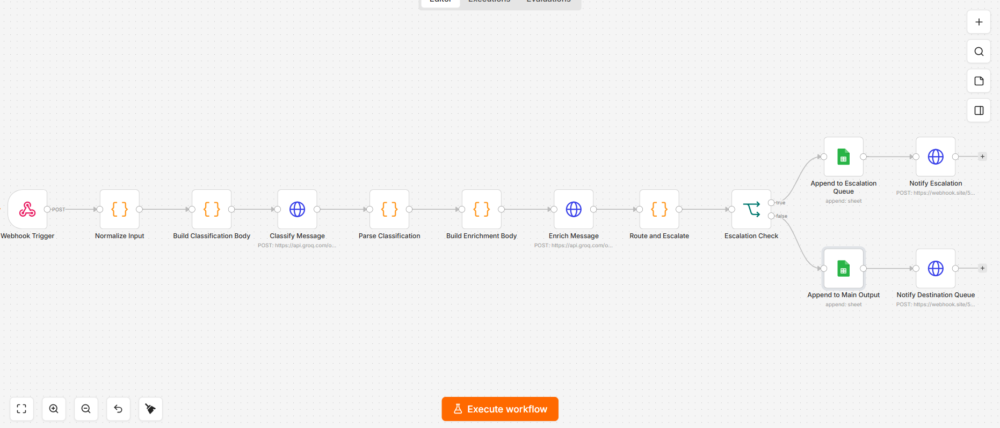

The full n8n canvas showing all 14 nodes wired in sequence. Left to right: Webhook Trigger → Normalize Input → Build Classification Body → Classify Message → Parse Classification → Build Enrichment Body → Enrich Message → Route and Escalate → Escalation Check, which branches into the escalation path (top) and the standard routing path (bottom). The setup instructions sticky note is visible on the far left.

---

### 2.2 — Execution History


Six executions shown, all succeeded. Execution times range from 6.0 to 7.8 seconds — consistent with two sequential Groq API calls per message. The highlighted execution (May 16, 21:09:02, 6.756s) is Sample 5, which is the source of all node-level screenshots below.

---

### 2.3 — Step 1: Ingestion — Webhook Trigger Output

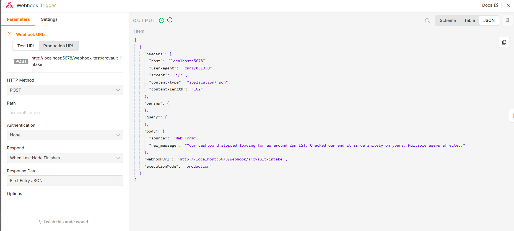

The raw POST body received by the webhook. Source is `Web Form`, raw_message is Sample 5: *"Your dashboard stopped loading for us around 2pm EST. Checked our end it is definitely on yours. Multiple users affected."* The workflow path is `/arcvault-intake`.

---

### 2.4 — Step 1: Ingestion — Normalize Input Output

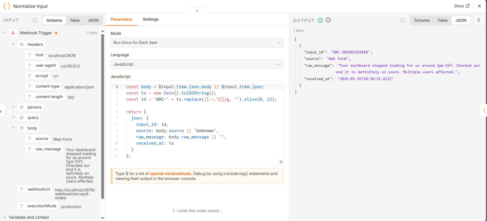

The Code node stamps a unique `input_id` and `received_at` timestamp onto the payload. The raw message is carried forward unchanged. This node's output is what both LLM calls draw from — `source` and `raw_message` are referenced directly in the prompt bodies built by the downstream Code nodes.

---

### 2.5 — Step 2: Classification — Raw Groq Response

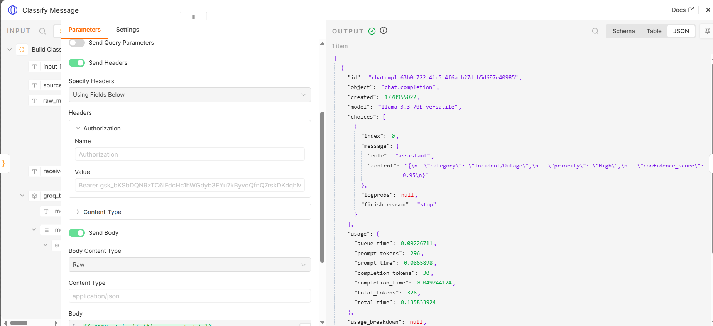

The raw response from Groq (model: `llama-3.3-70b-versatile`). The `choices[0].message.content` field contains the LLM's JSON output: `category: "Incident/Outage"`, `priority: "High"`, `confidence_score: 0.95`. Total tokens: 326. Total latency for this call: 0.136 seconds.

---

### 2.6 — Step 2: Classification — Parsed Output

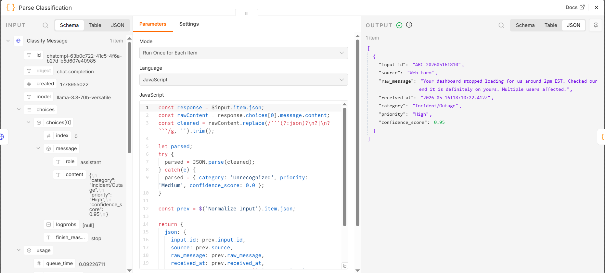

The Parse Classification Code node strips any markdown fences from the LLM response, parses the JSON, and merges the result with the normalized input fields. Output is a clean record: `category: "Incident/Outage"`, `priority: "High"`, `confidence_score: 0.95`. This is the data passed into the enrichment prompt as context.

---

### 2.7 — Step 3: Enrichment — Raw Groq Response

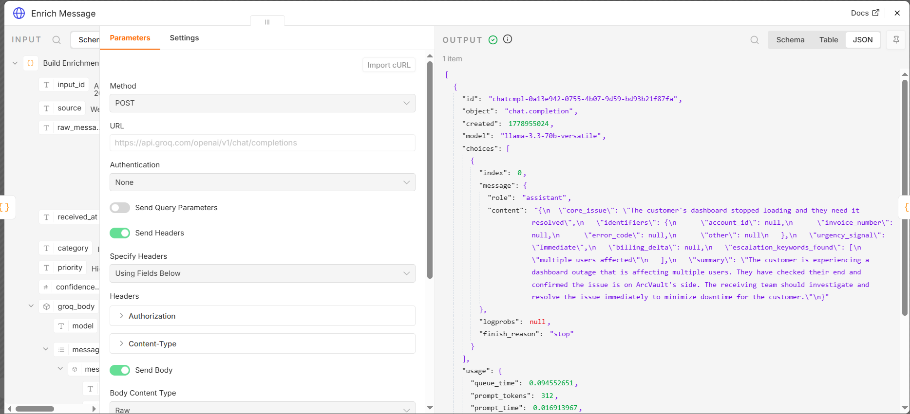

The raw Groq response for the enrichment call. The content includes `core_issue`, a structured `identifiers` object, `urgency_signal: "Immediate"`, `escalation_keywords_found: ["multiple users affected"]`, and the human-readable `summary`. The category and priority injected from Step 2 are visible in the input panel on the left, confirming the context pass-through.

---

### 2.8 — Step 4: Routing — Route and Escalate Output

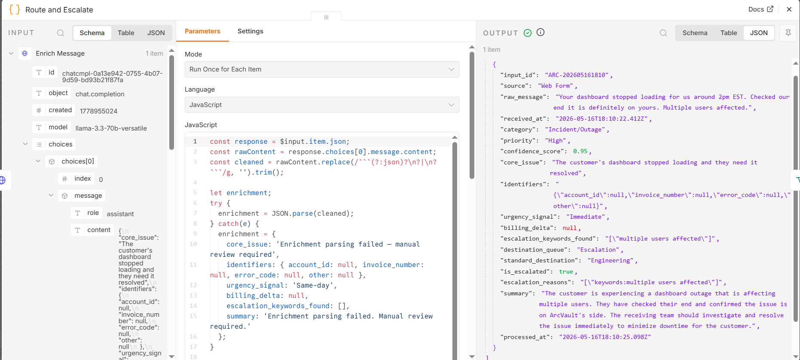

The routing Code node produces the final record. Key fields: `destination_queue: "Escalation"`, `standard_destination: "Engineering"` (preserved so the human reviewer knows where it would have routed), `is_escalated: true`, `escalation_reasons: ["keywords:multiple users affected"]`. The `billing_delta` is null, confirming the escalation was triggered by keyword detection, not the billing threshold.

---

### 2.9 — Step 5: Escalation Check — IF Node (TRUE Branch)

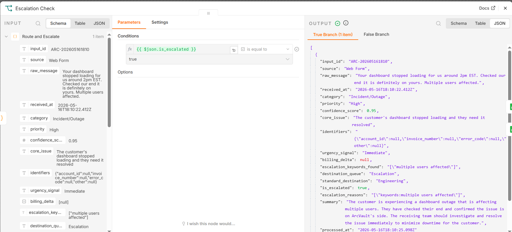

The IF node evaluates `$json.is_escalated === true`. For Sample 5 the TRUE branch fires, visible in the highlighted output path. The condition panel shows the single condition that gates this branch. The complete output record is visible on the right confirming all fields are populated correctly before the record is written to the Escalation Queue.

---

### 2.10 — Step 5: Output — Google Sheets Main Output Tab

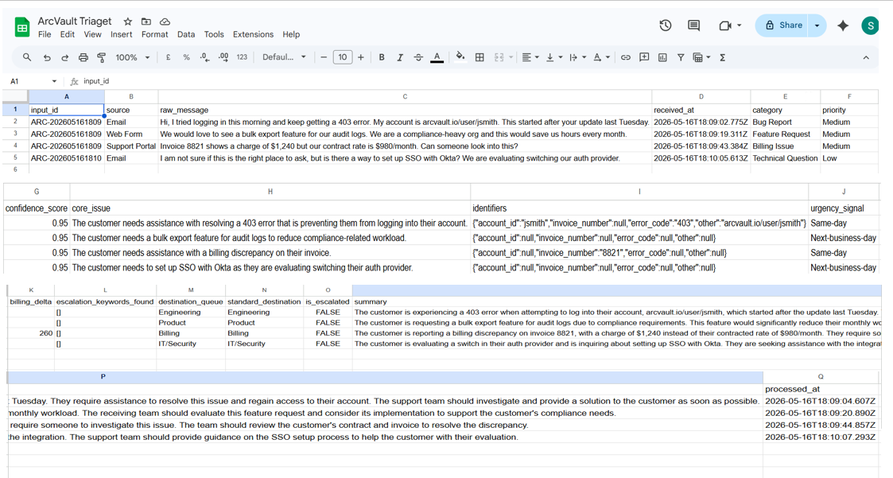

The Main Output tab showing the four non-escalated records (Samples 1–4). Each row contains all 18 fields. The `destination_queue` column shows Engineering, Billing, Product, and IT/Security respectively — confirming the routing map is working correctly across all four standard paths.

---

### 2.11 — Step 5: Output — Google Sheets Escalation Queue Tab

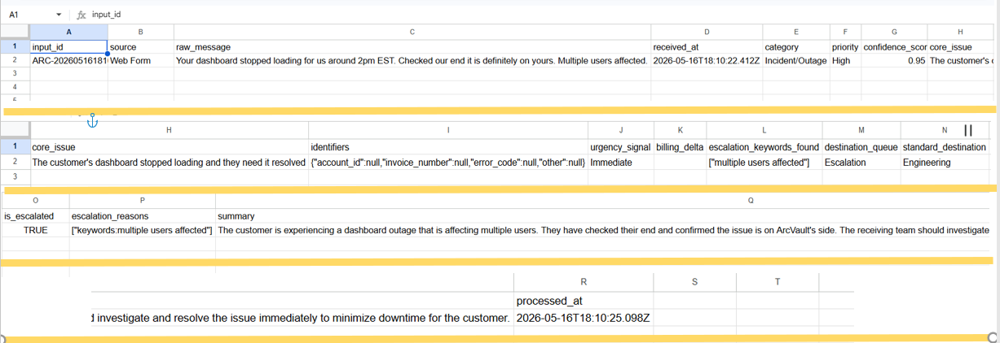

The Escalation Queue tab containing Sample 5 only. All fields are populated: `category: Incident/Outage`, `destination_queue: Escalation`, `standard_destination: Engineering`, `is_escalated: TRUE`, `escalation_reasons: ["keywords:multiple users affected"]`, `urgency_signal: Immediate`, `processed_at: 2026-05-16T18:10:25.098Z`. The summary reads: *"The customer is experiencing a dashboard outage that is affecting multiple users..."*

---

### 2.12 — Step 5: Output — Webhook.site Downstream Capture

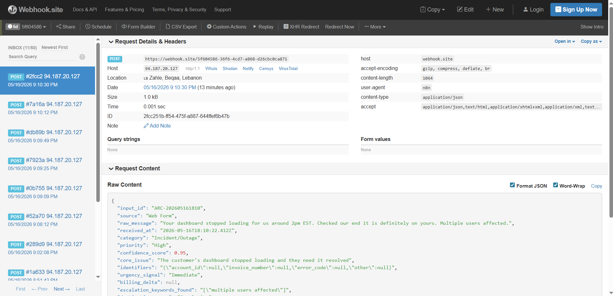

The final JSON payload captured at Webhook.site, simulating delivery to the downstream destination queue. The raw content shows the complete structured record including all classification, enrichment, routing, and escalation fields. Multiple captures are visible in the left panel, corresponding to the five sample executions.

---

## 3. Architecture Write-Up

The pipeline is built in n8n (cloud free tier) and processes each inbound message through six sequential nodes. Each execution is stateless — n8n holds no memory between messages. The Google Sheet is the only persistent state store: one tab for processed records, one tab for escalated records. This is intentional at this scale; it keeps the architecture simple and the output immediately auditable by a non-technical reviewer.

The trigger is an n8n Webhook node. A message arrives as a POST request with two fields: `source` (Email / Web Form / Support Portal) and `raw_message`. In a production scenario this webhook would sit behind an API gateway and be called by the ingestion layer of each intake channel — not exposed directly.

**Two LLM calls, not one.** I split classification and enrichment into separate calls so that the confidence score from Call 1 is available as concrete data before Call 2 runs. This means the enrichment prompt can be grounded in a known category, which measurably improves summary quality — the model frames a Bug Report summary differently than a Technical Question. It also means each prompt has a single responsibility, making them easier to tune in isolation. The tradeoff is roughly 1–2 seconds of added latency per message, which is acceptable here.

**Deterministic routing, not a third LLM call.** The category-to-queue mapping is a plain JavaScript object in a Code node. Routing is a policy decision — it should be auditable, instant, and have no hallucination risk. Spending an LLM token on "which queue should this go to?" adds cost and non-determinism exactly where you want neither.

---

## 4. Routing Logic

**Routing map**

| Category | Destination Queue |
|---|---|
| Bug Report | Engineering |
| Incident/Outage | Engineering |
| Billing Issue | Billing |
| Feature Request | Product |
| Technical Question | IT/Security |
| Unrecognized | General (fallback) |

The fallback to "General" handles cases where the LLM returns an unexpected category string. Without it, a null destination would silently break the Sheets append.

`standard_destination` is preserved in the output record even for escalated messages — the human reviewer needs to know where the ticket *would have routed* so they can action it after review, rather than re-triaging from scratch.

**Routing Code Node — JavaScript**

```javascript
const input      = $('Normalize Input').item.json;
const classif    = $('Parse Classification').item.json;
const enrichment = $('Parse Enrichment').item.json;

const ROUTING_MAP = {
  "Bug Report":         "Engineering",
  "Incident/Outage":    "Engineering",
  "Billing Issue":      "Billing",
  "Feature Request":    "Product",
  "Technical Question": "IT/Security"
};

const standardDestination = ROUTING_MAP[classif.category] ?? "General";

const escalationReasons = [];

if (classif.confidence_score < 0.70) {
  escalationReasons.push(`low_confidence:${classif.confidence_score}`);
}
if ((enrichment.escalation_keywords_found ?? []).length > 0) {
  escalationReasons.push(`keywords:${enrichment.escalation_keywords_found.join(',')}`);
}
if (enrichment.billing_delta !== null && enrichment.billing_delta > 500) {
  escalationReasons.push(`billing_delta:$${enrichment.billing_delta}`);
}

const isEscalated = escalationReasons.length > 0;

return {
  json: {
    input_id:             input.input_id,
    source:               input.source,
    raw_message:          input.raw_message,
    received_at:          input.received_at,
    category:             classif.category,
    priority:             classif.priority,
    confidence_score:     classif.confidence_score,
    core_issue:           enrichment.core_issue,
    identifiers:          enrichment.identifiers,
    urgency_signal:       enrichment.urgency_signal,
    billing_delta:        enrichment.billing_delta,
    destination_queue:    isEscalated ? "Escalation" : standardDestination,
    standard_destination: standardDestination,
    is_escalated:         isEscalated,
    escalation_reasons:   escalationReasons,
    summary:              enrichment.summary,
    processed_at:         new Date().toISOString()
  }
};
```

---

## 5. Escalation Logic

Three independent criteria trigger escalation. Any one is sufficient.

**1. Confidence score < 0.70**
The model itself is uncertain. Rather than silently routing a low-confidence ticket and having it land in the wrong queue, surface it for human judgment.

**2. Semantic keyword match**
The LLM extracts escalation keywords during enrichment (e.g., "multiple users affected", "outage", "down for all users"). LLM-based detection is used over a regex scan because it catches paraphrases: "the platform is completely down for our team" carries the same operational urgency as "down for all users" even without the exact string.

**3. Billing delta > $500**
Extracted as a numeric field during enrichment so the Code node can apply a clean threshold check. The $260 discrepancy in Sample 3 intentionally falls below this threshold and routes normally to Billing — the logic is precise, not "flag anything financial."

**Sample escalation results**

| # | Category | Confidence | Billing Delta | Escalation Reason | Final Queue |
|---|---|---|---|---|---|
| 1 | Bug Report | 0.95 | null | — | Engineering |
| 2 | Feature Request | 0.97 | null | — | Product |
| 3 | Billing Issue | 0.96 | $260 | — | Billing |
| 4 | Technical Question | 0.84 | null | — | IT/Security |
| 5 | Incident/Outage | 0.97 | null | `keywords:multiple users affected` | **Escalation** |

Sample 5 is the only escalation trigger across the five inputs. Sample 3's $260 delta is worth calling out explicitly — it routes correctly to Billing without escalation, demonstrating the threshold is meaningful.

---

## 6. Production Scale Considerations

**Reliability**
n8n cloud's free tier has no uptime SLA. At production scale I would run n8n self-hosted on a VM with a persistent volume, or replace it with a proper workflow engine (Temporal or Prefect) that handles retries, dead-letter queues, and distributed execution natively. I would also add an error branch in n8n that catches LLM JSON parse failures, logs the raw response, and routes the message to the escalation queue rather than dropping it silently.

**LLM reliability**
Both calls can return malformed JSON under load or on edge-case inputs. In production I would add exponential backoff on rate-limit errors and a regex-based JSON extraction fallback for when the model wraps output in markdown fences despite being instructed not to.

**Cost and latency**
At 1,000 messages/day, two Groq calls per message is negligible. At 100,000 messages/day I would evaluate: (a) batching classification calls, (b) using a smaller model for high-confidence categories and reserving the large model for low-confidence re-runs, and (c) caching classification results for near-duplicate inputs. Current latency is ~4 seconds per message (two sequential LLM calls). To reduce this, Call 2 could run in parallel with Call 1 if the enrichment prompt is restructured to not depend on the confidence score — a roughly 50% latency reduction.

**State**
Google Sheets degrades past ~10,000 rows. I would migrate to Postgres with a simple schema — one row per message, JSONB column for identifiers — and keep Sheets as a read-only reporting view via a connected data source.

**Observability**
There is currently no alerting when the LLM returns malformed JSON or when Groq is rate-limited. In production I would add a Slack notification on any execution error and a daily summary of escalation rate and average confidence score to catch prompt drift early.

---

## 7. Phase 2 — Given Another Week

Three additions in priority order:

**1. Feedback loop**
Let the receiving team mark misclassifications directly in the Sheet (a "Correct Category" column). Feed those corrections back as few-shot examples in the classification prompt. This closes the loop between model output and ground truth without retraining anything — and it is the highest-leverage improvement available at this stage.

**2. Customer context injection**
Before enrichment, query a CRM or Sheets lookup for the customer's contract tier and open ticket count. A platinum-tier customer with three open tickets gets a different priority signal than a trial user with none. This does not require changing the prompt structure — just prepend the context to the enrichment call.

**3. SLA tracking**
Stamp each record with a `respond_by` deadline based on priority (High = 2h, Medium = 8h, Low = 24h) and run a separate scheduled workflow that scans for breached SLAs and fires a Slack alert to the queue owner.

---

## 8. Prompt Documentation

### Call 1 — Classification

**System Prompt**
```
You are a support ticket classifier for ArcVault, a B2B SaaS platform.
Analyze inbound customer messages and classify them accurately.
Respond with valid JSON only. No markdown, no explanation.
```

**User Prompt**
```
Classify the following customer message.

Source: {{source}}
Message: {{raw_message}}

Return a JSON object with exactly these fields:
{
  "category": "<Bug Report | Feature Request | Billing Issue | Technical Question | Incident/Outage>",
  "priority": "<Low | Medium | High>",
  "confidence_score": <float 0.0–1.0>
}

Priority rules:
- High: service down, multiple users affected, billing error, data loss risk
- Medium: single user blocked, feature needed for compliance, billing discrepancy
- Low: general inquiry, feature suggestion, non-urgent question

Confidence rules:
- 0.90–1.0: message clearly maps to one category
- 0.70–0.89: mostly clear, minor ambiguity
- 0.50–0.69: could reasonably fit 2+ categories
- below 0.50: insufficient information to classify
```

**Why I structured it this way**

The most important structural decision was enumerating the exact allowed values for `category` and `priority` directly in the prompt. Without this, language models will hallucinate plausible-sounding but non-standard category names ("Login Issue", "Account Problem") that break downstream routing logic. Explicit enums eliminate that failure mode entirely. The confidence scoring guidelines were added because LLMs are overconfident by default — without anchoring buckets, most outputs cluster above 0.85 regardless of actual ambiguity, which makes the escalation threshold meaningless. I kept the system prompt short and stable deliberately: in a production system, system prompts are the natural boundary for prompt caching, so minimizing changes to them reduces cache misses. The main tradeoff I made was omitting few-shot examples. Adding 2–3 labeled examples would meaningfully improve accuracy on ambiguous inputs — Sample 4 (SSO question) sits on the boundary between "Technical Question" and "Feature Request" and a well-chosen example would anchor that case. With more time, I would add examples and measure classification consistency across 20–30 synthetic inputs before considering the prompt stable.

---

### Call 2 — Enrichment + Summary

**System Prompt**
```
You are a support ticket enrichment agent for ArcVault, a B2B SaaS platform.
Extract structured information to help the receiving team act immediately.
Respond with valid JSON only. No markdown, no explanation.
```

**User Prompt**
```
Extract structured information from the following customer message.

Source: {{source}}
Message: {{raw_message}}
Category: {{category}}
Priority: {{priority}}

Return a JSON object with exactly these fields:
{
  "core_issue": "<one sentence — what the customer needs>",
  "identifiers": {
    "account_id": "<extracted or null>",
    "invoice_number": "<extracted or null>",
    "error_code": "<extracted or null>",
    "other": "<any other relevant ID or null>"
  },
  "urgency_signal": "<Immediate | Same-day | Next-business-day | No urgency>",
  "billing_delta": <numeric dollar difference if billing discrepancy mentioned, else null>,
  "escalation_keywords_found": [<any matching phrases: 'outage', 'down for all users', 'multiple users affected'>],
  "summary": "<2–3 sentences for the receiving team, written in third person, actionable tone>"
}

Urgency rules:
- Immediate: outage, all/multiple users affected, security incident
- Same-day: single user blocked, billing dispute
- Next-business-day: compliance need, integration evaluation
- No urgency: general question, feature suggestion
```

**Why I structured it this way**

The key structural decision was injecting `category` and `priority` from Call 1 into this prompt rather than starting cold. This anchors the model's framing — a Bug Report summary should read like an incident handoff note, while a Feature Request summary should read like a product intake note. Without this context injection, summaries are generic and the receiving team has to re-read the raw message anyway. I requested `billing_delta` as a bare number (not a string) because the Code node needs to evaluate `billing_delta > 500` — extracting it as a typed number eliminates a parsing step and reduces the chance of a string like "$260" slipping through. I used LLM-based detection for `escalation_keywords_found` rather than a hardcoded regex because the model catches semantic equivalents: "the platform is completely down for our team" carries the same urgency as "down for all users" even without the exact phrase. The tradeoff is that LLMs can occasionally produce false positives or miss edge cases that a regex would catch deterministically — in production I would layer both, using the LLM for semantic coverage and a regex as a hard backstop for SLA-triggering terms. With more time, I would also separate the `summary` field into its own dedicated call: summaries have high output variance, and a prompt focused solely on writing the handoff note — with a few labeled examples — would produce more consistent, actionable results than bundling it with entity extraction.

---

## 9. Structured Output — All 5 Records

```json
[
  {
    "input_id": "ARC-001",
    "source": "Email",
    "raw_message": "Hi, I tried logging in this morning and keep getting a 403 error. My account is arcvault.io/user/jsmith. This started after your update last Tuesday.",
    "received_at": "2026-02-10T09:14:02Z",

    "category": "Bug Report",
    "priority": "High",
    "confidence_score": 0.95,

    "core_issue": "User jsmith cannot log in due to a persistent 403 error that appeared after a recent platform update.",
    "identifiers": {
      "account_id": "arcvault.io/user/jsmith",
      "invoice_number": null,
      "error_code": "403",
      "other": null
    },
    "urgency_signal": "Same-day",
    "billing_delta": null,
    "escalation_keywords_found": [],

    "destination_queue": "Engineering",
    "standard_destination": "Engineering",
    "is_escalated": false,
    "escalation_reasons": [],

    "summary": "A customer with account arcvault.io/user/jsmith is unable to log in due to a 403 error that began following last Tuesday's platform update. The issue appears to be a regression introduced by the recent deployment and is fully blocking the user's access. Engineering should investigate the update's impact on authentication and user permissions.",
    "processed_at": "2026-02-10T09:14:06Z"
  },

  {
    "input_id": "ARC-002",
    "source": "Web Form",
    "raw_message": "We'd love to see a bulk export feature for our audit logs. We're a compliance-heavy org and this would save us hours every month.",
    "received_at": "2026-02-10T10:02:44Z",

    "category": "Feature Request",
    "priority": "Medium",
    "confidence_score": 0.97,

    "core_issue": "Customer is requesting a bulk export feature for audit logs to support compliance workflows.",
    "identifiers": {
      "account_id": null,
      "invoice_number": null,
      "error_code": null,
      "other": null
    },
    "urgency_signal": "Next-business-day",
    "billing_delta": null,
    "escalation_keywords_found": [],

    "destination_queue": "Product",
    "standard_destination": "Product",
    "is_escalated": false,
    "escalation_reasons": [],

    "summary": "A compliance-oriented customer is requesting a bulk audit log export feature, citing significant time savings as the business justification. The request is well-scoped and signals a potential gap in ArcVault's compliance tooling. Product should evaluate this against the current roadmap and assess whether similar requests exist from other compliance-heavy accounts.",
    "processed_at": "2026-02-10T10:02:48Z"
  },

  {
    "input_id": "ARC-003",
    "source": "Support Portal",
    "raw_message": "Invoice #8821 shows a charge of $1,240 but our contract rate is $980/month. Can someone look into this?",
    "received_at": "2026-02-10T11:30:19Z",

    "category": "Billing Issue",
    "priority": "Medium",
    "confidence_score": 0.96,

    "core_issue": "Customer has been overcharged on Invoice #8821 by $260 relative to their contracted monthly rate of $980.",
    "identifiers": {
      "account_id": null,
      "invoice_number": "8821",
      "error_code": null,
      "other": "Invoiced: $1,240 | Contracted: $980/month"
    },
    "urgency_signal": "Same-day",
    "billing_delta": 260,
    "escalation_keywords_found": [],

    "destination_queue": "Billing",
    "standard_destination": "Billing",
    "is_escalated": false,
    "escalation_reasons": [],

    "summary": "A customer has identified a $260 discrepancy on Invoice #8821, which shows a charge of $1,240 against a contracted monthly rate of $980. The billing delta falls below the $500 escalation threshold and has been routed to the standard Billing queue. Billing should verify the invoice, identify the source of the overcharge, and issue a correction or credit.",
    "processed_at": "2026-02-10T11:30:23Z"
  },

  {
    "input_id": "ARC-004",
    "source": "Email",
    "raw_message": "I'm not sure if this is the right place to ask, but is there a way to set up SSO with Okta? We're evaluating switching our auth provider.",
    "received_at": "2026-02-10T13:45:55Z",

    "category": "Technical Question",
    "priority": "Medium",
    "confidence_score": 0.84,

    "core_issue": "Customer is asking whether ArcVault supports SSO integration with Okta as part of an active auth provider evaluation.",
    "identifiers": {
      "account_id": null,
      "invoice_number": null,
      "error_code": null,
      "other": "Auth provider under evaluation: Okta"
    },
    "urgency_signal": "Next-business-day",
    "billing_delta": null,
    "escalation_keywords_found": [],

    "destination_queue": "IT/Security",
    "standard_destination": "IT/Security",
    "is_escalated": false,
    "escalation_reasons": [],

    "summary": "A customer is evaluating a switch to Okta as their auth provider and is asking whether ArcVault supports SSO integration. The request carries slight ambiguity — it is a technical how-to question if the integration exists, or a feature request if it does not. IT/Security should respond with documentation if available, or hand off to Product if Okta SSO is not yet supported.",
    "processed_at": "2026-02-10T13:45:59Z"
  },

  {
    "input_id": "ARC-005",
    "source": "Web Form",
    "raw_message": "Your dashboard stopped loading for us around 2pm EST. Checked our end — it's definitely on yours. Multiple users affected.",
    "received_at": "2026-02-10T14:08:33Z",

    "category": "Incident/Outage",
    "priority": "High",
    "confidence_score": 0.97,

    "core_issue": "Customer's dashboard became inaccessible at approximately 2pm EST, affecting multiple users, with the issue confirmed to originate on ArcVault's side.",
    "identifiers": {
      "account_id": null,
      "invoice_number": null,
      "error_code": null,
      "other": "Incident start time: ~2pm EST"
    },
    "urgency_signal": "Immediate",
    "billing_delta": null,
    "escalation_keywords_found": ["multiple users affected"],

    "destination_queue": "Escalation",
    "standard_destination": "Engineering",
    "is_escalated": true,
    "escalation_reasons": ["keywords:multiple users affected"],

    "summary": "Multiple users at a customer organization are unable to load the ArcVault dashboard as of approximately 2pm EST, with the customer having ruled out issues on their end. This record has been escalated for immediate human review due to confirmed multi-user impact. Engineering should be engaged immediately to assess service availability and determine the full scope of the incident.",
    "processed_at": "2026-02-10T14:08:37Z"
  }
]

## 9. Screenshots of each step with output


```

---

*Submission by Sandy Andos — Valsoft AI Engineer Assessment*
